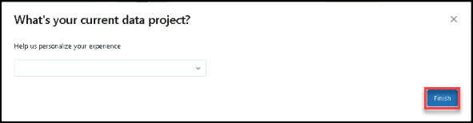
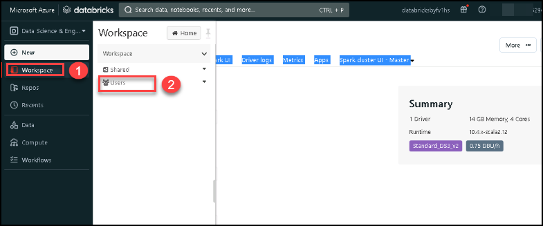
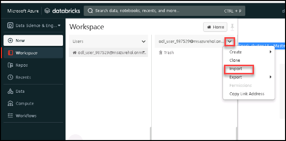
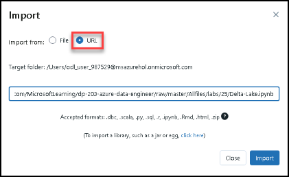
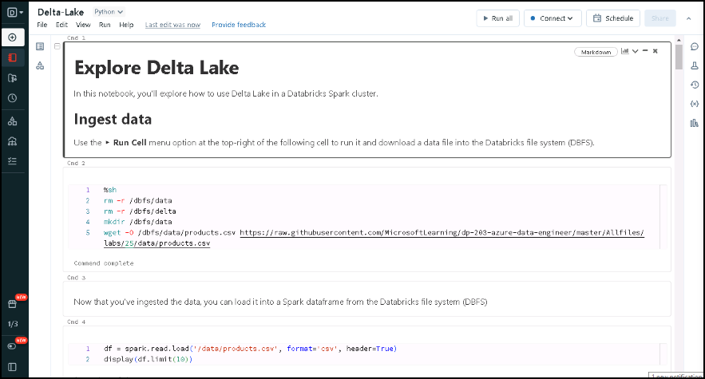

# Lab 25: Use Delta Lake in Azure Databricks

Delta Lake is an open source project to build a transactional data storage layer for Spark on top of a data lake. Delta Lake adds support for relational semantics for both batch and streaming data operations, and enables the creation of a *Lakehouse* architecture in which Apache Spark can be used to process and query data in tables that are based on underlying files in the data lake.

## Task 1:  Provision an Azure Databricks workspace

In this task, you'll use a script to provision a new Azure Databricks workspace.

1. In a web browser, sign into the [Azure portal](https://portal.azure.com) at `https://portal.azure.com`.
2. Use the **[\>_]** button to the right of the search bar at the top of the page to create a new Cloud Shell in the Azure portal.

    

3. Selecting a ***PowerShell*** environment and creating storage if prompted. The cloud shell provides a command line interface in a pane at the bottom of the Azure portal, as shown here:

    

    > **Note**: If you have previously created a cloud shell that uses a *Bash* environment, use the the drop-down menu at the top left of the cloud shell pane to change it to ***PowerShell***.

    


4. If You dont have precreated storage account then select advanced setting.

    

5. Keep all settings default and give unique storage account name and in file share section write **None**.

    

6. Note that you can resize the cloud shell by dragging the separator bar at the top of the pane, or by using the **&#8212;**, **&#9723;**, and **X** icons at the top right of the pane to minimize, maximize, and close the pane. For more information about using the Azure Cloud Shell, see the [Azure Cloud Shell documentation](https://docs.microsoft.com/azure/cloud-shell/overview)

    

7. In the PowerShell pane, enter the following commands to clone this repo:

    ```
    rm -r dp-203 -f
    git clone https://github.com/MicrosoftLearning/dp-203-azure-data-engineer dp-203
    ```

8. After the repo has been cloned, enter the following commands to change to the folder for this lab and run the **setup.ps1** script it contains:

    ```
    cd dp-203/Allfiles/labs/25
    ./setup.ps1
    ```

9. If prompted, choose which subscription you want to use (this will only happen if you have access to multiple Azure subscriptions).

10. Wait for the script to complete - this typically takes around 5 minutes, but in some cases may take longer. While you are waiting, review the [Introduction to Delta Lake](https://docs.microsoft.com/azure/databricks/delta/delta-intro) article in the Azure Databricks documentation.

    

## Task 2: Create a cluster

Azure Databricks is a distributed processing platform that uses Apache Spark *clusters* to process data in parallel on multiple nodes. Each cluster consists of a driver node to coordinate the work, and worker nodes to perform processing tasks.

> **Note**: In this task, you'll create a *single-node* cluster to minimize the compute resources used in the lab environment (in which resources may be constrained). In a production environment, you'd typically create a cluster with multiple worker nodes.

1. In the Azure portal, browse to the **dp203-*xxxxxxx*** resource group that was created by the script you ran.

    

    


2. Select the **databricks*xxxxxxx*** Azure Databricks Service resource.

    

3. In the **Overview** page for **databricks*xxxxxxx***, use the **Launch Workspace** button to open your Azure Databricks workspace in a new browser tab; signing in if prompted.

    

4. If a **What's your current data project?** message is displayed, select **Finish** to close it. Then view the Azure Databricks workspace portal and note that the sidebar on the left side contains icons for the various tasks you can perform. The sidebar expands to show the names of the task categories.

    

5. Select the **(+) New** task, and then select **Cluster**.

    

    **Note**: If a tip is displayed, use the **Got it** button to close it. This applies to any future tips that may be displayed as you navigate the workspace interface for the first time.

6. In the **New Cluster** page, create a new cluster with the following settings:
    - **Cluster name**: *User Name's* cluster (the default cluster name)
    - **Cluster mode**: Single Node
    - **Access mode** (*if prompted*): Single user
    - **Databricks runtime version**: 10.4 LTS (Scala 2.12, Spark 3.2.1)
    - **Use Photon Acceleration**: Unselected
    - **Node type**: Standard_DS3_v2
    - **Terminate after** *30* **minutes of inactivity**

    


7. Wait for the cluster to be created. It may take a minute or two.

    

> **Note**: If your cluster fails to start, your subscription may have insufficient quota in the region where your Azure Databricks workspace is provisioned. See [CPU core limit prevents cluster creation](https://docs.microsoft.com/azure/databricks/kb/clusters/azure-core-limit) for details. If this happens, you can try deleting your workspace and creating a new one in a different region. You can specify a region as a parameter for the setup script like this: `./setup.ps1 eastus`

## Task 3: Explore data using a notebook

As in many Spark environments, Databricks supports the use of notebooks to combine notes and interactive code cells that you can use to explore data.

1. Expand the task bar on the left and select the **Workspace** tab. Then select the **Users** folder and in the **&#9662;** menu for the **&#8962; *your_user_name*** folder, select **Import**.

    

1. In the **Import Notebooks** dialog box.

    
   
1.  select **URL** and import the notebook from `https://github.com/MicrosoftLearning/dp-203-azure-data-engineer/raw/master/Allfiles/labs/25/Delta-Lake.ipynb`.

     


1. Select **&#8962; Home** and then open the **Delta-Lake** notebook you just imported.

    

1. Ensure that the notebook is attached to ***User Name's* cluster**, and follow the instructions it contains; running the cells it contains to work with Delta Lake.


  > **Congratulations** You have Successfully completed all Task!
