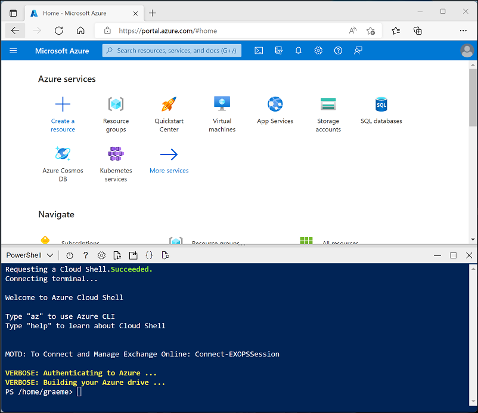

# Lab 27: Automate an Azure Databricks Notebook with Azure Data Factory

## Lab-Scenario

You can use notebooks in Azure Databricks to perform data engineering tasks, such as processing data files and loading data into tables. When you need to orchestrate these tasks as part of a data engineering pipeline, you can use Azure Data Factory. In this lab, you'll explore about notebooks in Azure Databricks to perform data engineering tasks, such as processing data files and loading data into tables.

### Objectives

After completing this lab, you will be able to:

 - Import a notebook.
 - Enable Azure Databricks integration with Azure Data Factory.
 - Use a pipeline to run the Azure Databricks notebook.

### Estimated timing: 45 minutes

### Architecture Diagram

   

## Task 1: Provision Azure resources

In this task, you'll use a script to provision a new Azure Databricks workspace and an Azure Data Factory resource in your Azure subscription.

1. Click on **Cloud Shell** button **[\>_]** button to the right of the search bar at the top of the page to create a new Cloud Shell in the Azure portal, select a ***PowerShell*** environment and click on **Create Storage** if prompted. The cloud shell provides a command line interface in a pane at the bottom of the Azure portal, as shown here:

    

    > **Note**: If you have previously created a cloud shell that uses a *Bash* environment, use the the drop-down menu at the top left of the cloud shell pane to change it to ***PowerShell***.

2. Note that you can resize the cloud shell by dragging the separator bar at the top of the pane, or by using the **&#8212;**, **&#9723;**, and **X** icons at the top right of the pane to minimize, maximize, and close the pane. For more information about using the Azure Cloud Shell, see the [Azure Cloud Shell documentation](https://docs.microsoft.com/azure/cloud-shell/overview).

3. In the PowerShell pane, enter the following commands to clone this repo:

    ```
    rm -r dp-203 -f
    git clone https://github.com/MicrosoftLearning/dp-203-azure-data-engineer dp-203
    ```

4. After the repo has been cloned, enter the following commands to change to the folder for this lab and run the **setup.ps1** script it contains:

    ```
    cd dp-203/Allfiles/labs/27
    ./setup.ps1
    ```

5. If prompted, choose which subscription you want to use (this will only happen if you have access to multiple Azure subscriptions).

6. Wait for the script to complete - this typically takes around 5 minutes, but in some cases may take longer. While you are waiting, review [What is Azure Data Factory?](https://docs.microsoft.com/azure/data-factory/introduction).
7. When the script has completed, close the cloud shell pane and browse to the **dp203-*xxxxxxx*** resource group that was created by the script to verify that it contains an Azure Databricks workspace and an Azure Data Factory (V2) resource (you may need to refresh the resource group view).

## Task 2: Import a notebook

You can create notebooks in your Azure Databricks workspace to run code written in a range of programming languages. In this exercise, you'll import an existing notebook that contains some Python code.

1. In the Azure portal, browse to the **dp203-*xxxxxxx*** resource group that was created by the script you ran.
   
2. Select the **databricks*xxxxxxx*** Azure Databricks Service resource.
   
3. In the **Overview** page for **databricks*xxxxxxx***, use the **Launch Workspace** button to open your Azure Databricks workspace in a new browser tab; signing in if prompted.
   
4. If a **What's your current data project?** message is displayed, select **Finish** to close it. Then view the Azure Databricks workspace portal and note that the sidebar on the left side contains icons for the various tasks you can perform.

    >**Tip**: As you use the Databricks Workspace portal, various tips and notifications may be displayed. Dismiss these and follow the instructions provided to complete the tasks in this exercise.

7. In the sidebar on the left, select **Workspace**. Then select the **&#8962; Home** folder.

8. At the top of the page, in the **&#8942;** menu next to your user name, select **Import**. Then in the **Import** dialog box, select **URL** and import the notebook from `https://github.com/MicrosoftLearning/dp-203-azure-data-engineer/raw/master/Allfiles/labs/27/Process-Data.ipynb`

9. Review the contents of the notebook, which include some Python code cells to:
    - Retrieve a parameter named **folder** if it is has been passed (otherwise use a default value of *data*).
    - Download data from GitHub and save it in the specified folder in the Databricks File System (DBFS).
    - Exit the notebook, returning the path where the data was saved as an output

       > **Tip**: The notebook could contain practically any data processing logic you need. This simple example is designed to show the key principles.

## Task 3: Enable Azure Databricks integration with Azure Data Factory

To use Azure Databricks from an Azure Data Factory pipeline, you need to create a linked service in Azure Data Factory that enables access to your Azure Databricks workspace.

### Task 3.1: Generate an access token

1. In the Azure Databricks portal, at on the top right menu bar, select the username and then select **User Settings** from the drop-down.
   
2. In the **User Settings** page, select **Developer**. Then next to **Access tokens** select **Manage**.
   
3. Select **Generate new token** and generate a new token with the comment *Data Factory* and a blank lifetime (so the token doesn't expire). Be careful to **copy the token when it is displayed <u>before</u> selecting *Done***.

4. Paste the copied token to a text file so you have it handy for later in this exercise.

### Task 3.2: Create a linked service in Azure Data Factory

1. Return to the Azure portal, and in the **dp203-*xxxxxxx*** resource group, select the **adf*xxxxxxx*** Azure Data Factory resource.
   
2. On the **Overview** page, select the **Launch studio** to open the Azure Data Factory Studio. Sign in if prompted.
   
3. In Azure Data Factory Studio, use the **>>** icon to expand the navigation pane on the left. Then select the **Manage** page.
   
4. On the **Manage** page, in the **Linked services** tab, select **+ New** to add a new linked service.
   
5. In the **New linked service** pane, select the **Compute** tab at the top. Then select **Azure Databricks**.
   
6. Continue, and create the linked service with the following settings:
    - **Name**: AzureDatabricks
    - **Description**: Azure Databricks workspace
    - **Connect via integration runtime**: AutoResolveInegrationRuntime
    - **Account selection method**: From Azure subscription
    - **Azure subscription**: *Select your subscription*
    - **Databricks workspace**: *Select your **databricksxxxxxxx** workspace*
    - **Select cluster**: New job cluster
    - **Databrick Workspace URL**: *Automatically set to your Databricks workspace URL*
    - **Authentication type**: Access token
    - **Access token**: *Paste your access token*
    - **Cluster version**: 13.3 LTS (Spark 3.4.1, Scala 2.12)
    - **Cluster node type**: Standard_DS3_v2
    - **Python version**: 3
    - **Worker options**: Fixed
    - **Workers**: 1

## Task 4: Use a pipeline to run the Azure Databricks notebook

Now that you have created a linked service, you can use it in a pipeline to run the notebook you viewed previously.

### Task 4.1: Create a pipeline

1. In Azure Data Factory Studio, in the navigation pane, select **Author**.
   
2. On the **Author** page, in the **Factory Resources** pane, use the **+** icon to add a **Pipeline**.
   
3. In the **Properties** pane for the new pipeline, change its name to **Process Data with Databricks**. Then use the **Properties** button (which looks similar to **&#128463;<sub>*</sub>**) on the right end of the toolbar to hide the **Properties** pane.
   
4. In the **Activities** pane, expand **Databricks** and drag a **Notebook** activity to the pipeline designer surface.
   
5. With the new **Notebook1** activity selected, set the following properties in the bottom pane:
    - **General**:
        - **Name**: Process Data
    - **Azure Databricks**:
        - **Databricks linked service**: *Select the **AzureDatabricks** linked service you created previously*
    - **Settings**:
        - **Notebook path**: *Browse to the **Users/your_user_name** folder and select the **Process-Data** notebook*
        - **Base parameters**: *Add a new parameter named **folder** with the value **product_data***
          
6. Use the **Validate** button above the pipeline designer surface to validate the pipeline. Then use the **Publish all** button to publish (save) it.

### Task 4.2: Run the pipeline

1. Above the pipeline designer surface, select **Add trigger**, and then select **Trigger now**.
   
2. In the **Pipeline run** pane, select **OK** to run the pipeline.
   
3. In the navigation pane on the left, select **Monitor** and observe the **Process Data with Databricks** pipeline on the **Pipeline runs** tab. It may take a while to run as it dynamically creates a Spark cluster and runs the notebook. You can use the **&#8635; Refresh** button on the **Pipeline runs** page to refresh the status.

    > **Note**: If your pipeline fails, your subscription may have insufficient quota in the region where your Azure Databricks workspace is provisioned to create a job cluster. See [CPU core limit prevents cluster creation](https://docs.microsoft.com/azure/databricks/kb/clusters/azure-core-limit) for details. If this happens, you can try deleting your workspace and creating a new one in a different region. You can specify a region as a parameter for the setup script like this: `./setup.ps1 eastus`

4. When the run succeeds, select its name to view the run details. Then, on the **Process Data with Databricks** page, in the **Activity Runs** section, select the **Process Data** activity and use its ***output*** icon to view the output JSON from the activity, which should resemble this:
    ```json
    {
        "runPageUrl": "https://adb-..../run/...",
        "runOutput": "dbfs:/product_data/products.csv",
        "effectiveIntegrationRuntime": "AutoResolveIntegrationRuntime (East US)",
        "executionDuration": 61,
        "durationInQueue": {
            "integrationRuntimeQueue": 0
        },
        "billingReference": {
            "activityType": "ExternalActivity",
            "billableDuration": [
                {
                    "meterType": "AzureIR",
                    "duration": 0.03333333333333333,
                    "unit": "Hours"
                }
            ]
        }
    }
    ```

5. Note the **runOutput** value, which is the *path* variable to which the notebook saved the data.

  **Congratulations** on completing the lab! Now, it's time to validate it. Here are the steps:

  > - Navigate to the Lab Validation tab, from the upper right corner in the lab guide section.
  > - Hit the Validate button for the corresponding task. If you receive a success message, you have successfully validated the lab. 
  > - If not, carefully read the error message and retry the step, following the instructions in the lab guide.
  > - If you need any assistance, please contact us at labs-support@spektrasystems.com.

 ## Review

 In this lab, you have accomplished the following:
 - Import a notebook.
 - Enable Azure Databricks integration with Azure Data Factory.
 - Use a pipeline to run the Azure Databricks notebook.
 
 ## You have successfully completed the lab.
