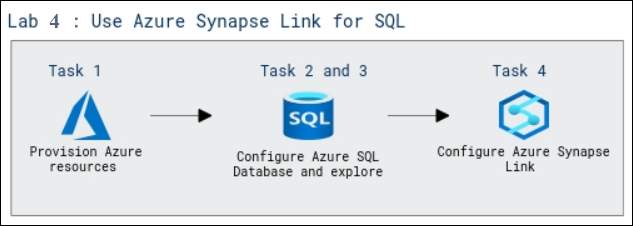
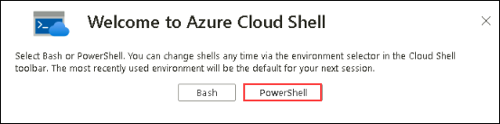
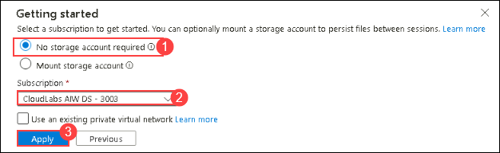
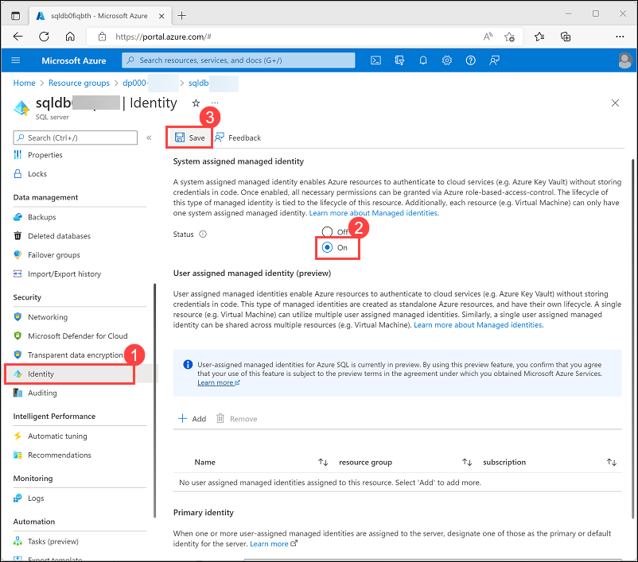
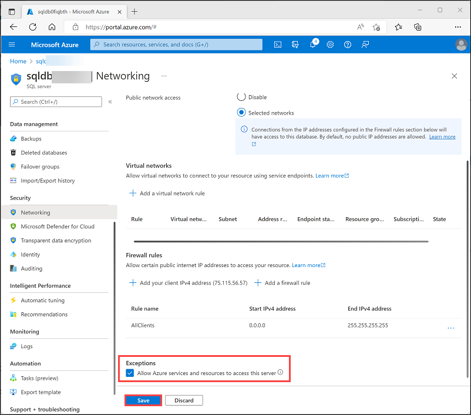
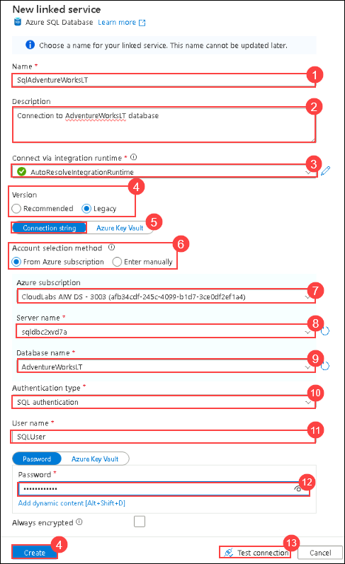

# Lab 4: Use Azure Synapse Link for SQL

## Lab Scenario

Azure Synapse Link for SQL enables you to automatically synchronize a transactional database in SQL Server or Azure SQL Database with a dedicated SQL pool in Azure Synapse Analytics. This synchronization enables you to perform low-latency analytical workloads in Synapse Analytics without incurring query overhead in the source operational database. In this lab, you will explore about Azure Synapse Link for SQL which enables low-latency synchronization of operational data in a relational database to Azure Synapse Analytics.

### Objectives
  
In this lab, you will be able to complete the following tasks:

- Task 1: Provision Azure resources
- Task 2: Configure Azure SQL Database
- Task 3: Explore the transactional database
- Task 4: Configure Azure Synapse Link

### Estimated timing: 45 minutes

### Architecture Diagram

   

## Task 1: Provision Azure resources

In this exercise, you'll synchronize data from an Azure SQL Database resource to an Azure Synapse Analytics workspace. You'll start by using a script to provision these resources in your Azure subscription.

1. Use the **[\>_]** button to the right of the search bar at the top of the page to create a new Cloud Shell in the Azure portal, and select ***PowerShell*** environment.
    
    

    

    
2. In the **Getting Started** menu,choose **No storage account required (1)**,select your default **Subscription (2)** from the dropdown and click on **Apply (3)**

   

3. Note that you can resize the cloud shell by dragging the separator bar at the top of the pane, or by using the **&#8212;**, **&#9723;**, and **X** icons at the top right of the pane to minimize, maximize, and close the pane. For more information about using the Azure Cloud Shell, see the [Azure Cloud Shell documentation](https://docs.microsoft.com/azure/cloud-shell/overview).

4. In the PowerShell pane, enter the following commands to clone this repo:

    ```
    rm -r dp-203 -f
    git clone https://github.com/MicrosoftLearning/dp-203-azure-data-engineer dp-203
    ```

5. After the repo has been cloned, enter the following commands to change to the folder for this exercise and run the **setup.ps1** script it contains:

    ```
    cd dp-203/Allfiles/labs/15
    ./setup.ps1
    ```

6. If prompted, choose which subscription you want to use (this will only happen if you have access to multiple Azure subscriptions).
   
7. When prompted, enter a suitable password for your Azure SQL Database.

    > **Note**: Be sure to remember this password!

8. Wait for the script to complete - this typically takes around 15 minutes, but in some cases may take longer. While you are waiting, review the [What is Azure Synapse Link for SQL?](https://docs.microsoft.com/azure/synapse-analytics/synapse-link/sql-synapse-link-overview) article in the Azure Synapse Analytics documentation.

## Task 2: Configure Azure SQL Database

Before you can set up Azure Synapse Link for your Azure SQL Database, you must ensure that the required configuration settings have been applied in your Azure SQL Database server.

1. In the [Azure portal](https://portal.azure.com), browse to the **dp203-*xxxxxxx*** resource group that was created by the setup script, and select your **sqldb*xxxxxxxx*** Azure SQL server.

    > **Note**: be careful not to mix up the Azure SQL server resource **sqldb*xxxxxxxx***) and the Azure Synapse Analytics dedicated SQL pool (**sql*xxxxxxxx***).

2. In the page for your Azure SQL Server resource, in the pane on the left, in the **Security** section (near the bottom), select **Identity (1)**. Then under **System assigned managed identity**, set the **Status** option to **On (2)**. Then use the **&#128427; Save (3)** icon to save your configuration change.

    

3. In the pane on the left, in the **Security** section, select **Networking**. Then, under **Firewall rules**, select the exception checkbox to **Allow Azure services and resources to access this server**.

4. Use the **&#65291; Add a firewall rule** button to add a new firewall rule with the following settings:

    | Rule name | Start IP | End IP |
    | -- | -- | -- |
    | AllClients | 0.0.0.0 | 255.255.255.255 |

    > **Note**: This rule allows access to your server from any Internet-connected computer. We're enabling this to simplify the exercise, but in a production scenario, you should restrict access to only network addresses that need to use your databases.

5. Use the **Save** button to save your configuration change:

    


## Task 3: Explore the transactional database

Your Azure SQL server hosts a sample database named **AdventureWorksLT**. This database represents a transactional database used for operational application data.

1. In the **Overview** page for your Azure SQL server, at the bottom of the page, select the **AdventureWorksLT** database:
   
2. In the **AdventureWorksLT** database page, from the left navigation pane, select the **Query editor** tab and log in using SQL server authentication with the following credentials:
    - **Login** SQLUser
    - **Password**: *The password you specified when running the setup script.*
      
3. When the query editor opens, expand the **Tables** node and view the list of tables in the database. Note that they include tables in a **SalesLT** schema (for example, **SalesLT.Customer**).

## Task 4: Configure Azure Synapse Link

Now you're ready to configure Azure Synapse Link for SQL in your Synapse Analytics workspace.

### Task 4.1: Start the dedicated SQL pool

1. In the Azure portal, close the query editor for your Azure SQL database (discarding any changes) and return to the page for your **dp203-*xxxxxxx*** resource group.
2. Open the **synapse*xxxxxxx*** Synapse workspace, and on its **Overview** page, in the **Open Synapse Studio** card, select **Open** to open Synapse Studio in a new browser tab; signing in if prompted.
   
3. On the left side of Synapse Studio, use the **&rsaquo;&rsaquo;** icon to expand the menu - this reveals the different pages within Synapse Studio.
   
4. On the **Manage** page, on the **SQL pools** tab, select the row for the **sql*xxxxxxx*** dedicated SQL pool and use its **&#9655;** icon to start it; confirming that you want to resume it when prompted.
   
5. Wait for the SQL pool to resume. This can take a few minutes. You can use the **&#8635; Refresh** button to check its status periodically. The status will show as **Online** when it is ready.

### Task 4.2: Create the target schema

1. In Synapse Studio, on the **Data** page, on the **Workspace** tab, expand **SQL databases** and select your **sql*xxxxxxx*** database.
   
2. In the **...** menu for the **sql*xxxxxxx*** database, select **New SQL script** > **Empty script**.
   
3. In the **SQL Script 1** pane, enter the following SQL code and use the  **&#9655; Run** button to run it.

    ```sql
    CREATE SCHEMA SalesLT;
    GO
    ```

4. Wait for the query to complete successfully. This code creates a schema named **SalesLT** in the database for your dedicated SQL pool, enabling you to synchronize tables in the schema of that name from your Azure SQL database.

### Task 4.3: Create a link connection

1. In Synapse Studio, on the **Integrate** page, select the **&#65291;** icon and from drop-down menu, select **Link connection**. Then create a new linked connection with the following settings:
    - **Source type**: Azure SQL database
    - **Source linked service**: Select **+ New** from the dropdown to add a new linked service with the following settings (a new tab will be opened):
        - **Name**: SqlAdventureWorksLT (1)
        - **Description**: Connection to AdventureWorksLT database (2)
        - **Connect via integration runtime**: AutoResolveIntegrationRuntime (3)
        - **Version**:Legacy (4)
        - **Connection String**: Selected (5)
        - **From Azure subscription**: Selected(6)
        - **Azure subscription**: *Select your Azure subscription*(7)
        - **Server name**: *Select your **sqldbxxxxxxx** Azure SQL server*(8)
        - **Database name**: AdventureWorksLT (9)
        - **Authentication type**: SQL authentication (10)
        - **User name**: SQLUser (11)
        - **Password**: *The password you set when running the setup script* (12)

        *Use the **Test Connection** (13) option to ensure your connection settings are correct before continuing! Afterwards, click **Create** (14).

        

    - **Source tables**: Select the following tables:
        - **SalesLT.Customer**
        - **SalesLT.Product**
        - **SalesLT.SalesOrderDetail**
        - **SalesLT.SalesOrderHeader**
        - Click **Continue** to configure the following settings

    > **Note**: Some target tables display an error due to the use of custom data types or because data in the source table is not compatible with the default structure type of *clustered columnstore index*.

    - **Target pool**: *Select your **sqlxxxxxxx** dedicated SQL pool*
    - Click **Continue** to configure the following settings

    - **Link connection name**: sql-adventureworkslt-conn
    - **Core count**: 4 (+ 4 Driver cores)
    - Click **Ok**

2. In the **sql-adventureworkslt-conn** page that is created, view the table mappings that have been created. You can use the **Properties** button (which looks similar to **&#128463;<sub>*</sub>**) to hide the **Properties** pane to make it easier to see eveything. 

3. Modify the structure types in the table mappings as follows:

    |Source table|Target table|Distribution type|Distribution column|Structure type|
    |--|--|--|--|--|
    |SalesLT.Customer **&#8594;**|\[SalesLT].\[Customer]|Round robin|-|Clustered columnstore index|
    |SalesLT.Product **&#8594;**|\[SalesLT].\[Product]|Round robin| - |Heap|
    |SalesLT.SalesOrderDetail **&#8594;**|\[SalesLT].\[SalesOrderDetail]|Round robin|-|Clustered columnstore index|
    |SalesLT.SalesOrderHeader **&#8594;**|\[SalesLT].\[SalesOrderHeader]|Round robin|-|Heap|

4. At the top of the **sql-adventureworkslt-conn** page that is created, use the **&#9655; Start** button to start synchronization. When prompted, select **OK** to publish and start the link connection.

5. Click on **Publish** to Publish all the pending changes.
   
5. After starting the connection, on the **Monitor** page, select the **Link connections** tab and view the **sql-adventureworkslt-conn** connection. You can use the **&#8635; Refresh** button to update the status periodically. It may take several minutes to complete the initial snapshot copy process and start replicating - after that, all changes in the source database tables will be automatically replayed in the synchronized tables.

### Tsk 4.4: View the replicated data

1. After the status of the tables has changed to **Running**, select the **Data** page and use the  **&#8635;** icon at the top right to refresh the view.
   
2. Select **Data** pane, click **Workspace** tab, expand **SQL databases**,  your **sql*xxxxxxx*** database, and its **Tables** folder to view the replicated tables.
   
3. In the **...** menu for the **sql*xxxxxxx*** database, select **New SQL script** > **Empty script**. Then in the new script page, enter the following SQL code:

    ```sql
    SELECT  oh.SalesOrderID, oh.OrderDate,
            p.ProductNumber, p.Color, p.Size,
            c.EmailAddress AS CustomerEmail,
            od.OrderQty, od.UnitPrice
    FROM SalesLT.SalesOrderHeader AS oh
    JOIN SalesLT.SalesOrderDetail AS od 
        ON oh.SalesOrderID = od.SalesOrderID
    JOIN  SalesLT.Product AS p 
        ON od.ProductID = p.ProductID
    JOIN SalesLT.Customer as c
        ON oh.CustomerID = c.CustomerID
    ORDER BY oh.SalesOrderID;
    ```

4. Use the **&#9655; Run** button to run the script and view the results. The query is run against the replicated tables in the dedicated SQL pool and not the source database, enabling you to run analytical queries without impacting business applications.
   
5. When you're done, on the **Manage** page, pause the **sql*xxxxxxx*** dedicated SQL pool.

## Validation

<validation step="cdaacaeb-71cb-4907-8d83-52897d503a83" />

## Review

In this lab, you have accomplished the following:
- Configure Azure SQL Database.
- Explore the transactional database.
- Configure Azure Synapse Link.

## You have successfully completed the lab.
