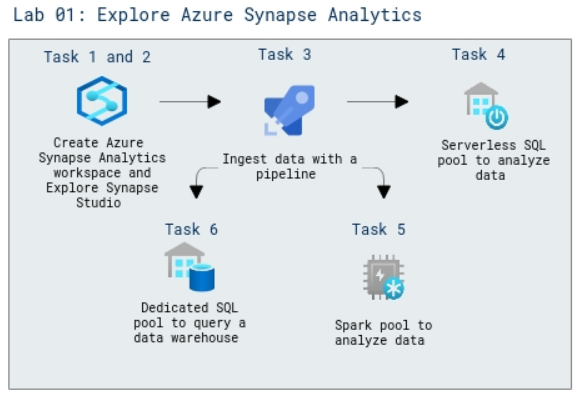

# Lab Scenario Preview: DP-203: Get started with data engineering on Azure

## Lab 01: Explore Azure Synapse Analytics

### Lab overview

In this lab, you will explore various ways to ingest and explore data. This lab is designed as a high-level overview of the various core capabilities of Azure Synapse Analytics. 

### Objectives
  
After completing this lab, you will be able to:

- Provision an Azure Synapse Analytics workspace
- Explore Synapse Studio
- Ingesting data with a pipeline in Synapse Studio
- Analyze data using a serverless SQL pool
- Analyze data using the Spark pool
- Query a data warehouse using a dedicated SQL pool

### Architecture Diagram

   

>**Note**: Once you understand the lab's content, you can start the Hands-on Lab by clicking the **Launch** button located at the top right corner which leads you to the lab environment and lab guide interface. You can also have a detailed preview of the full lab guide [here](https://experience.cloudlabs.ai/#/labguidepreview/ae4975d8-2c61-4aff-9e6e-e042b5208ca0), prior to launching your environment.
