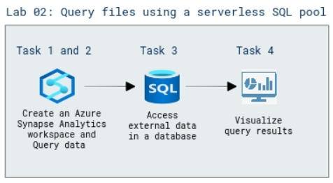

# Lab Scenario Preview: DP-203: Build data analytics solutions using Azure Synapse serverless SQL pools

## Lab 02: Query files using a serverless SQL pool

### Lab overview

In this lab, you will understand the technical tasks to design and implement data storage; develop data processing; and secure, monitor, and optimize data storage and data processing.

### Objectives
  
After completing this lab, you will be able to:

- Query the data in files
- Access external data in a database
- Visualize the query results

### Architecture Diagram

   

>**Note**: Once you understand the lab's content, you can start the Hands-on Lab by clicking the **Launch** button located at the top right corner which leads you to the lab environment and lab guide interface. You can also have a detailed preview of the full lab guide [here](https://experience.cloudlabs.ai/#/labguidepreview/d79f885e-ec9c-4de9-a0b2-15423b9750cb), prior to launching your environment.
