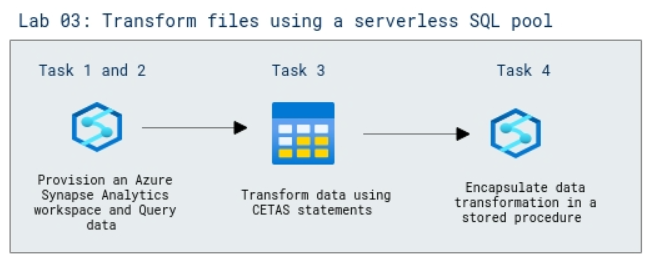

# Lab Scenario Preview: DP-203: Build data analytics solutions using Azure Synapse serverless SQL pools

## Lab 03: Transform files using a serverless SQL pool

### Lab overview

In this lab, you'll use a serverless SQL pool in Azure Synapse Analytics to transform data in files.

### Objectives
  
After completing this lab, you will be able to:

- Query the data in files
- Transform data using CREATE EXTERAL TABLE AS SELECT (CETAS) statements
- Encapsulate data transformation in a stored procedure

### Architecture Diagram

   

>**Note**: Once you understand the lab's content, you can start the Hands-on Lab by clicking the **Launch** button located at the top right corner which leads you to the lab environment and lab guide interface. You can also have a detailed preview of the full lab guide [here](https://experience.cloudlabs.ai/#/labguidepreview/41127a76-14c0-4e3a-bb04-d809647ca2d4), prior to launching your environment.
