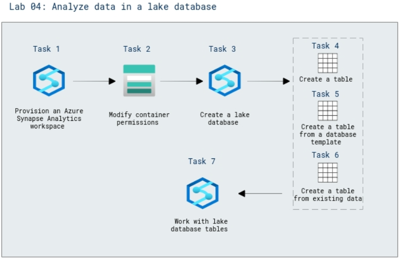

# Lab Scenario Preview: DP-203: Build data analytics solutions using Azure Synapse serverless SQL pools

## Lab 04: Analyze data in a lake database

### Lab overview

In this lab, you'll use a combination of a PowerShell script and an ARM template to provision an Azure Synapse Analytics workspace and will insert data into the lake database using Spark

### Objectives
  
After completing this lab, you will be able to:

- Modify container permissions in the Stroage account
- Create a lake database in Synapse Studio
- Create a table from a database template
- Create a table from existing data
- Work with lake database tables

### Architecture Diagram

   

>**Note**: Once you understand the lab's content, you can start the Hands-on Lab by clicking the **Launch** button located at the top right corner which leads you to the lab environment and lab guide interface. You can also have a detailed preview of the full lab guide [here](https://experience.cloudlabs.ai/#/labguidepreview/bf8d8bf1-2757-4d36-b2c4-e97cbd9506e5), prior to launching your environment.
