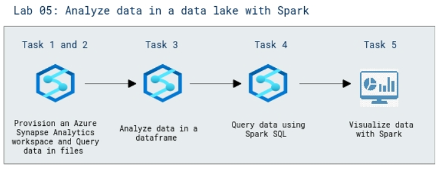

# Lab Scenario Preview: DP-203: Perform data engineering with Azure Synapse Apache Spark Pools

## Lab 05: Analyze data in a data lake with Spark

### Lab overview

In this lab, you will explore various ways to ingest and explore data. This lab is designed as a high-level overview of the various core capabilities of Azure Synapse Analytics.

### Objectives
  
After completing this lab, you will be able to:

- Query the data in files
- Analyze data in a data frame
- Query data using Spark SQL
- Visualize data with Spark

### Architecture Diagram

   

>**Note**: Once you understand the lab's content, you can start the Hands-on Lab by clicking the **Launch** button located at the top right corner which leads you to the lab environment and lab guide interface. You can also have a detailed preview of the full lab guide [here](https://experience.cloudlabs.ai/#/labguidepreview/4c8aba64-d0c3-428d-b105-9b992dd7ddf2), prior to launching your environment.
