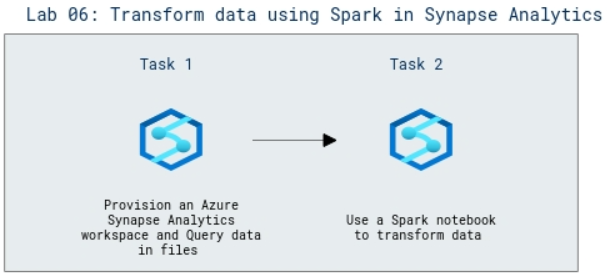

# Lab Scenario Preview: DP-203: Perform data engineering with Azure Synapse Apache Spark Pools

## Lab 06: Transform data using Spark in Synapse Analytics

### Lab overview

In this lab, you will explore the Spark notebook in Azure Synapse Analytics to transform data into files.

### Objectives
  
After completing this lab, you will be able to:

- Use a Spark notebook to transform data

### Architecture Diagram

   

>**Note**: Once you understand the lab's content, you can start the Hands-on Lab by clicking the **Launch** button located at the top right corner which leads you to the lab environment and lab guide interface. You can also have a detailed preview of the full lab guide [here](https://experience.cloudlabs.ai/#/labguidepreview/2c6b0728-b9f6-47c5-9ac6-8a00110d10e3), prior to launching your environment.
