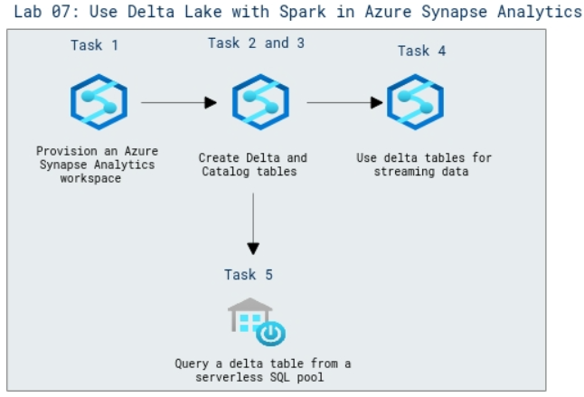

# Lab Scenario Preview: DP-203: Perform data engineering with Azure Synapse Apache Spark Pools

## Lab 07: Use Delta Lake with Spark in Azure Synapse Analytics

### Lab overview

In this lab, you will explore Delta Lake which is an open source relational storage area for Spark that you can use to implement a data lakehouse architecture in Azure Synapse Analytics.

### Objectives
  
After completing this lab, you will be able to:

- Create delta tables
- Create catalog tables
- Use delta tables for streaming data
- Query a delta table from a serverless SQL pool

### Architecture Diagram

   

>**Note**: Once you understand the lab's content, you can start the Hands-on Lab by clicking the **Launch** button located at the top right corner which leads you to the lab environment and lab guide interface. You can also have a detailed preview of the full lab guide [here](https://experience.cloudlabs.ai/#/labguidepreview/1e9d9481-c424-4693-9a2d-5a1c3791a791), prior to launching your environment.
