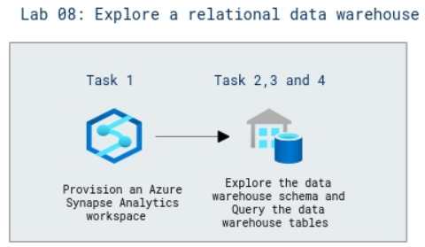

# Lab Scenario Preview: DP-203: Work with Data Warehouses using Azure Synapse Analytics

## Lab 08: Explore a relational data warehouse

### Lab overview

In this lab, you will understand about Relational data warehouses which are a core element of most enterprise Business Intelligence (BI) solutions, and are used as the basis for data models, reports, and analysis.

### Objectives

After completing this lab, you will be able to:

- Explore the data warehouse schema
- Query the data warehouse tables
- Challenge - Analyze reseller sales.

### Architecture Diagram

   

>**Note**: Once you understand the lab's content, you can start the Hands-on Lab by clicking the **Launch** button located at the top right corner which leads you to the lab environment and lab guide interface. You can also have a detailed preview of the full lab guide [here](https://experience.cloudlabs.ai/#/labguidepreview/71b49940-3a1d-4fe9-b070-4e95a2527caa), prior to launching your environment.
