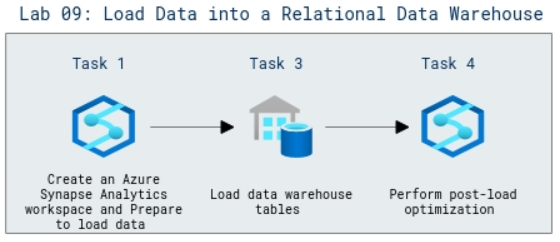

# Lab Scenario Preview: DP-203: Work with Data Warehouses using Azure Synapse Analytics

## Lab 09: Load Data into a Relational Data Warehouse

### Lab overview

In this lab, you will learn about data ingestion solution that loads new data into a relational data warehouse.

### Objectives

After completing this lab, you will be able to:

- Prepare to load data
- Load data warehouse tables
- Perform post-load optimization

### Architecture Diagram

   

>**Note**: Once you understand the lab's content, you can start the Hands-on Lab by clicking the **Launch** button located at the top right corner which leads you to the lab environment and lab guide interface. You can also have a detailed preview of the full lab guide [here](https://experience.cloudlabs.ai/#/labguidepreview/5144c2c7-e78a-4884-ba0f-7608ed98e07e), prior to launching your environment.
