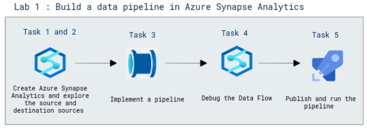

# Lab Scenario Preview: DP-203: Transfer and transform data with Azure Synapse Analytics pipelines

## Lab 1: Build a data pipeline in Azure Synapse Analytics

### Lab overview

In this lab, you will how to use Azure Synapse Analytics pipelines to build integrated data solutions that extract, transform, and load data across diverse systems.

### Objectives
  
After completing this lab, you will be able to:

- View source and destination data stores.
- Implement a pipeline.
- Debug the Data Flow.
- Publish and run the pipeline.

### Architecture Diagram

   

>**Note**: Once you understand the lab's content, you can start the Hands-on Lab by clicking the **Launch** button located at the top right corner which leads you to the lab environment and lab guide interface. You can also have a detailed preview of the full lab guide [here](https://experience.cloudlabs.ai/#/labguidepreview/ac64bc5f-5506-4b6d-82e9-b564e20ce6c3), prior to launching your environment.
