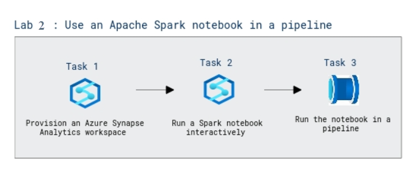

# Lab Scenario Preview: DP-203: Transfer and transform data with Azure Synapse Analytics pipelines

## Lab 11: Use an Apache Spark notebook in a pipeline

### Lab overview

In this lab, you will explore about creating an Azure Synapse Analytics pipeline that includes an activity to run an Apache Spark notebook.

### Objectives
  
After completing this lab, you will be able to:

- Run a Spark notebook interactively.
- Run the notebook in a pipeline.

### Architecture Diagram

   

>**Note**: Once you understand the lab's content, you can start the Hands-on Lab by clicking the **Launch** button located at the top right corner which leads you to the lab environment and lab guide interface. You can also have a detailed preview of the full lab guide [here](https://experience.cloudlabs.ai/#/labguidepreview/3df49db3-e160-49f4-860c-ad4821341ee5), prior to launching your environment.
