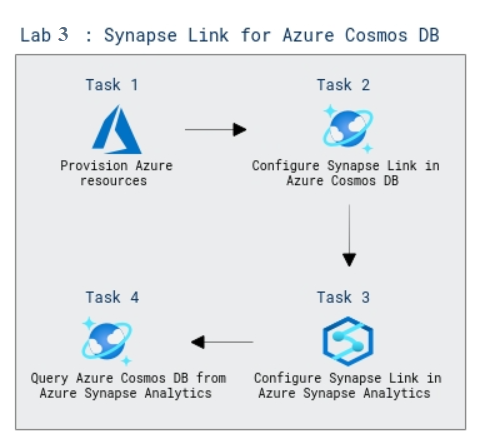

# Lab Scenario Preview: DP-203: Work with Hybrid Transactional and Analytical Processing Solutions using Azure Synapse Analytics

## Lab 14: Use Azure Synapse Link for Azure Cosmos DB

### Lab overview

In this lab, you will explore about Hybrid Transactional and Analytical Processing (HTAP) is a technique for near real time analytics without a complex ETL solution. Azure Synapse Link for Azure Cosmos DB enables HTAP integration between operational data in Azure Cosmos DB and Azure Synapse Analytics runtimes for Spark and SQL.

### Objectives
  
After completing this lab, you will be able to:

- Configure Synapse Link in Azure Cosmos DB.
- Configure Synapse Link in Azure Synapse Analytics.
- Query Azure Cosmos DB from Azure Synapse Analytics.

### Architecture Diagram

   

>**Note**: Once you understand the lab's content, you can start the Hands-on Lab by clicking the **Launch** button located at the top right corner which leads you to the lab environment and lab guide interface. You can also have a detailed preview of the full lab guide [here](https://experience.cloudlabs.ai/#/labguidepreview/3e991b51-03f4-4c2e-b643-937927d50478), prior to launching your environment.
