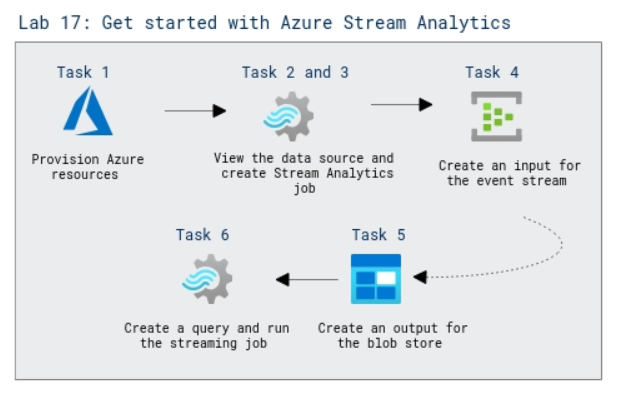

# Lab Scenario Preview: DP-203: Implement a Data Streaming Solution with Azure Stream Analytics

## Lab 17: Get started with Azure Stream Analytics

### Lab overview

In this lab, you will provision an Azure Stream Analytics job in your Azure subscription, and use it to query and summarize a stream of real-time event data and store the results in Azure Storage.

### Objectives

After completing this lab, you will be able to:

 - View the streaming data source.
 - Create an Azure Stream Analytics job
 - Create an input for the event stream
 - Create an output for the blob store
 - Create a query
 - Run the streaming job

  ### Architecture Diagram

   

>**Note**: Once you understand the lab's content, you can start the Hands-on Lab by clicking the **Launch** button located at the top right corner which leads you to the lab environment and lab guide interface. You can also have a detailed preview of the full lab guide [here](https://experience.cloudlabs.ai/#/labguidepreview/1a1ca7d2-e923-4ad2-98f6-990737a455de), prior to launching your environment.
