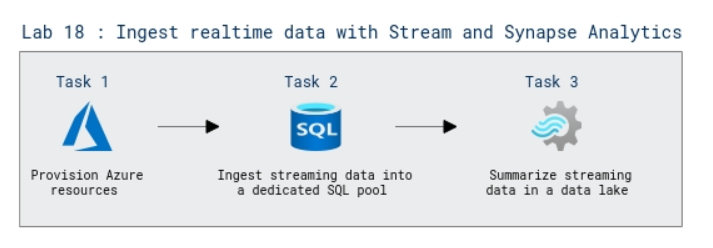

# Lab Scenario Preview: DP-203: Implement a Data Streaming Solution with Azure Stream Analytics

## Lab 18: Ingest realtime data with Azure Stream Analytics and Azure Synapse Analytics

### Lab overview

In this lab, you will learn about Azure Stream Analytics which provides a real-time data processing engine that you can use to ingest streaming event data into Azure Synapse Analytics for further analysis and reporting.

### Objectives

After completing this lab, you will be able to:

 - Ingest streaming data into a dedicated SQL pool
 - Summarize streaming data in a data lake

 ### Architecture Diagram

   

>**Note**: Once you understand the lab's content, you can start the Hands-on Lab by clicking the **Launch** button located at the top right corner which leads you to the lab environment and lab guide interface. You can also have a detailed preview of the full lab guide [here](https://experience.cloudlabs.ai/#/labguidepreview/068cec86-8f9b-4157-8df3-ab8e285a255f), prior to launching your environment.
