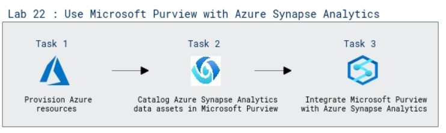

# Lab Scenario Preview: DP-203: Govern data across an enterprise

## Lab 22: Use Microsoft Purview with Azure Synapse Analytics

### Lab overview

In this lab, you'll learn about Microsoft Purview to track assets and data lineage in an Azure Synapse Analytics workspace

### Objectives

After completing this lab, you will be able to:

 - Catalog Azure Synapse Analytics data assets in Microsoft Purview.
 - Integrate Microsoft Purview with Azure Synapse Analytics.

 ### Architecture Diagram

   

>**Note**: Once you understand the lab's content, you can start the Hands-on Lab by clicking the **Launch** button located at the top right corner which leads you to the lab environment and lab guide interface. You can also have a detailed preview of the full lab guide [here](https://experience.cloudlabs.ai/#/labguidepreview/5812a6f7-fcdf-490e-9d65-346fd9432f5c), prior to launching your environment.
