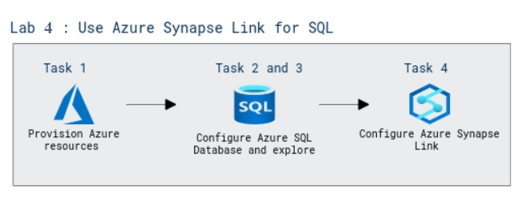

# Lab Scenario Preview: DP-203: Work with Hybrid Transactional and Analytical Processing Solutions using Azure Synapse Analytics

## Lab 15: Use Azure Synapse Link for SQL

### Lab overview

In this lab, you will explore about Azure Synapse Link for SQL which enables low-latency synchronization of operational data in a relational database to Azure Synapse Analytics.

### Objectives
  
After completing this lab, you will be able to:

- Configure Azure SQL Database.
- Explore the transactional database.
- Configure Azure Synapse Link.

### Architecture Diagram

   

>**Note**: Once you understand the lab's content, you can start the Hands-on Lab by clicking the **Launch** button located at the top right corner which leads you to the lab environment and lab guide interface. You can also have a detailed preview of the full lab guide [here](https://experience.cloudlabs.ai/#/labguidepreview/c08415e8-c4b9-4e74-ad1b-80aa629d4d61), prior to launching your environment.
